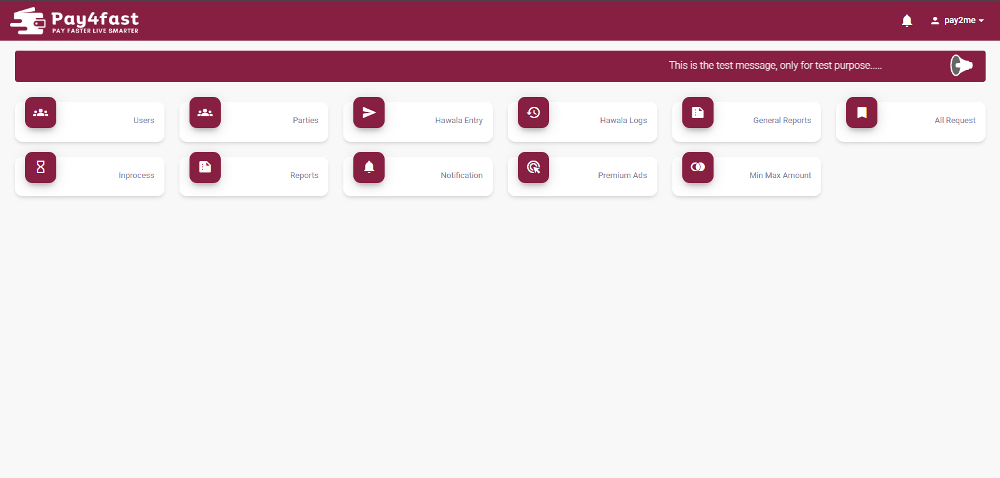
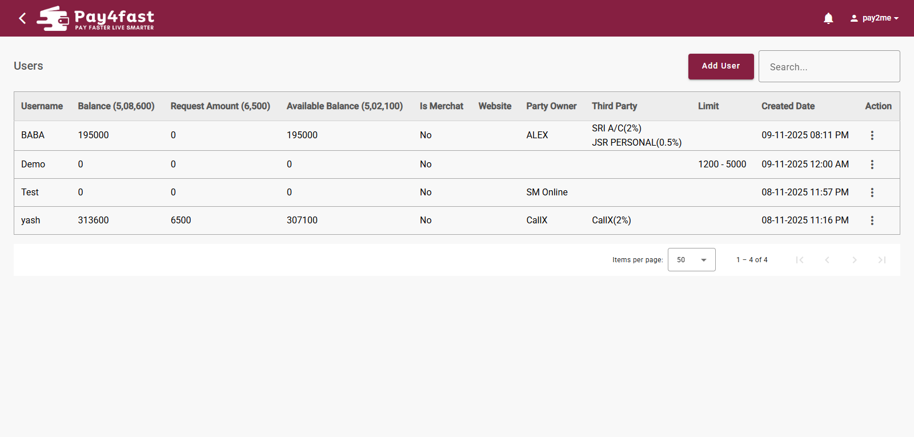
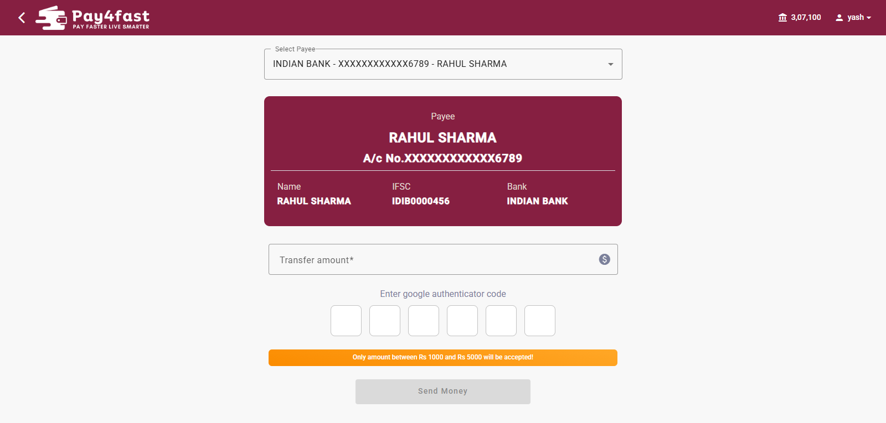
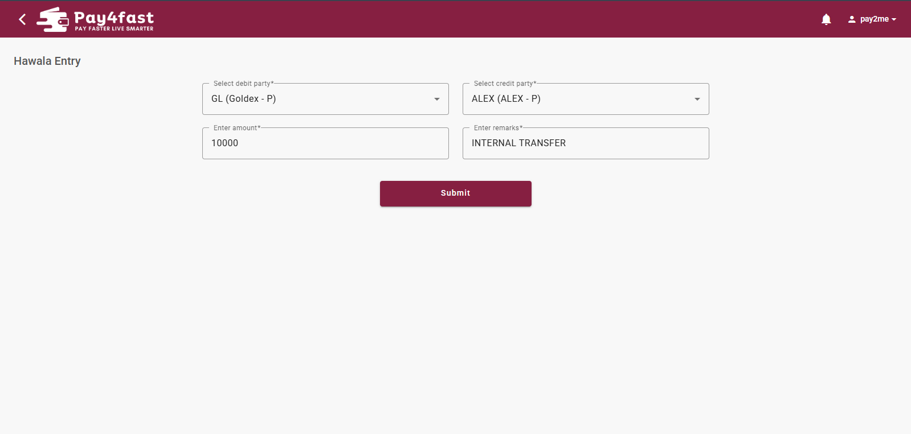

# Pay2Me

Pay2Me is a full-stack **financial transaction management platform** designed to manage users, parties, internal balances, commissions, beneficiary transfer requests, Hawala transactions, transaction limits, reports, and system notifications.

The application provides role-based access for **Admin, User, and Party**.

> **Important:** Pay2Me does not integrate with banks, UPI, payment gateways, or any real-money payment service. All balances and transactions are maintained as internal ledger records for transaction-management purposes.

---

## Project Type

* **Project Type:** Full-Stack Web Application
* **Category:** FinTech / Financial Transaction Management
* **Architecture:** Role-Based Enterprise Application
* **Frontend:** Angular
* **Backend:** ASP.NET Core Web API
* **Database:** Microsoft SQL Server
* **Data Access:** SQL Server Stored Procedures
* **Authentication:** Role-Based Authentication + Transaction Authentication
* **Payment Gateway:** None
* **Real Money Transactions:** No

---

# Technology Stack

## Frontend

* Angular
* TypeScript
* HTML5
* CSS
* Angular Services
* Angular Routing
* HTTP Client
* Reactive Forms

## Backend

* ASP.NET Core Web API
* C#
* RESTful APIs
* Custom database helper/service layer
* SQL Server Stored Procedure execution
* JSON-based request/response handling
* Role-based authorization

## Database

* Microsoft SQL Server
* Stored Procedures
* User-defined Table Types
* Relational database
* Transaction and ledger tables

---

# Backend Architecture

The Pay2Me backend is built using **ASP.NET Core Web API** and uses SQL Server Stored Procedures as the primary database-access mechanism.

A custom `Sp` database helper is used by the API to execute stored procedures and process their results.

The helper provides functionality for:

* Executing stored procedures with parameters
* Executing stored procedures and returning table results
* Returning string results
* Executing stored procedures with logged-in user information
* Passing IP address information for logging
* Executing stored procedures with SQL Server Table-Valued Parameters
* Converting SQL results into application-friendly data structures

---

## High-Level Architecture

                         ┌──────────────────────────────┐
                         │          PAY2ME              │
                         │   Financial Transaction      │
                         │      Management Platform     │
                         └──────────────┬───────────────┘
                                        │
                    ┌───────────────────┴───────────────────┐
                    │                                       │
             ┌──────▼──────┐                         ┌──────▼──────┐
             │    ADMIN    │                         │    USER     │
             │   PORTAL    │                         │   PORTAL    │
             └──────┬──────┘                         └──────┬──────┘
                    │                                       │
                    │                  ┌────────────────────┘
                    │                  │
             ┌──────▼──────────────────▼──────┐
             │          ANGULAR FRONTEND       │
             │                                │
             │  • Authentication              │
             │  • User Management             │
             │  • Party Management            │
             │  • Beneficiary Management       │
             │  • Transactions                │
             │  • Hawala                      │
             │  • Reports                     │
             │  • Notifications               │
             │  • Settings                    │
             └────────────────┬───────────────┘
                              │
                         HTTP / REST API
                              │
                    ┌─────────▼─────────┐
                    │  ASP.NET CORE    │
                    │     WEB API      │
                    │                  │
                    │  Controllers     │
                    │  Business Logic  │
                    │  Authorization   │
                    │  Validation      │
                    └─────────┬─────────┘
                              │
                              ▼
                    ┌─────────────────────┐
                    │   DATABASE HELPER   │
                    │                     │
                    │   SP Execution      │
                    │   Table Results     │
                    │   String Results    │
                    │   TVP Support       │
                    │   User Context      │
                    └──────────┬──────────┘
                               │
                               ▼
                    ┌─────────────────────┐
                    │     SQL SERVER      │
                    │                     │
                    │  Stored Procedures  │
                    │  Users              │
                    │  Parties            │
                    │  Beneficiaries      │
                    │  Transactions       │
                    │  Hawala             │
                    │  Reports / Logs     │
                    │  Settings           │
                    └─────────────────────┘

---

## Transaction Flow

                    ┌─────────────────┐
                    │      USER       │
                    └────────┬────────┘
                             │
                             ▼
                    ┌─────────────────┐
                    │ Select / Create │
                    │   Beneficiary   │
                    └────────┬────────┘
                             │
                             ▼
                    ┌─────────────────┐
                    │ Enter Transfer  │
                    │     Amount      │
                    └────────┬────────┘
                             │
                             ▼
                    ┌─────────────────┐
                    │ Authentication  │
                    │     Code        │
                    └────────┬────────┘
                             │
                             ▼
                    ┌─────────────────┐
                    │ Submit Transfer │
                    │     Request     │
                    └────────┬────────┘
                             │
                             ▼
                    ┌─────────────────┐
                    │     PENDING     │
                    │ Amount Blocked  │
                    └────────┬────────┘
                             │
                             ▼
                    ┌─────────────────┐
                    │      ADMIN      │
                    │    VERIFICATION │
                    └────────┬────────┘
                             │
                    ┌────────┴────────┐
                    │                 │
                  APPROVE           REJECT
                    │                 │
                    ▼                 ▼
             ┌─────────────┐   ┌─────────────┐
             │ IN PROGRESS │   │   REJECTED  │
             └──────┬──────┘   │Amount Return│
                    │          └─────────────┘
                    ▼
             ┌─────────────┐
             │   APPROVED  │
             │   Completed │
             └─────────────┘

---

# Database Access

Pay2Me uses a **Stored Procedure-based database architecture**.

Instead of putting SQL queries directly inside controllers, API operations call stored procedures through the database helper layer.

Example:

```text
Angular
   │
   ▼
ASP.NET Core API
   │
   ▼
Controller
   │
   ▼
SP / Database Helper
   │
   ▼
SQL Server Stored Procedure
   │
   ▼
SQL Server Database
```

Example stored procedure:

```text
User_GetUser
```

The same approach is used for other business operations such as:

```text
User Management
Party Management
Beneficiary Management
Transactions
Hawala
Reports
Settings
Notifications
```

---

# User Roles

Pay2Me has three main roles.

## 1. Admin

The Admin has complete control over the platform.

Admin can:

* Create and manage users
* Create and manage parties
* Manage user balances
* Set user transaction limits
* Set global transaction limits
* Change user passwords
* Change party passwords
* Enable/disable authentication
* Assign parties to users
* Configure party commissions
* Review beneficiary transfer requests
* Approve or reject transactions
* Move transactions to In-Progress status
* Manage Hawala transactions
* Reverse Hawala transactions
* View transaction logs
* Generate reports
* Configure broadcast notifications
* Configure promotional/Premium advertisements

---

## 2. User

Users can:

* Login
* View dashboard notifications
* Manage beneficiaries
* Add bank beneficiary details
* Initiate transfer requests
* Verify transactions using authentication codes
* View their internal balance
* View transaction history
* View transaction status
* View rejected transaction reasons

---

## 3. Party

Parties have restricted access.

Parties can:

* Login
* View their transaction logs
* View transaction history
* Monitor transactions associated with their account

---

# Main Modules

## Admin Modules

### Users

Admin can:

* Create users
* Edit users
* Change passwords
* Enable/disable authentication
* Set transaction limits
* Assign parties
* Configure party commissions
* View user transaction logs
* Manage user balances

### Parties

Admin can:

* Create parties
* Edit parties
* Change party passwords
* Enable/disable authentication
* View party transaction logs
* Associate parties with users

### Hawala

Admin can:

* Create Hawala entries
* Select debit account
* Select credit account
* Enter amount
* Add remarks
* View Hawala logs
* Reverse/delete Hawala transactions

### Reports

Admin can view:

* General transaction reports
* Hawala reports
* User reports
* Pending requests
* In-progress requests
* Transaction logs

### Settings

Admin can configure:

* Global transaction limits
* Broadcast notifications
* Premium advertisements
* Authentication-related settings

---

# User-Party Relationship

A user can have multiple parties associated with their account.

For example:

```text
User T
│
├── Party A
├── Party B
└── Party C
```

Admin can configure a commission percentage for each user-party relationship.

Example:

```text
User T
│
└── Party A
      └── Commission: 1%
```

---

# Beneficiary Management

Users can add their bank beneficiaries.

Beneficiary information may include:

* Beneficiary name
* Bank account number
* Bank name
* IFSC code
* Other required banking information

After adding a beneficiary, the user can initiate a transaction.

---

# Beneficiary Transaction Flow

```text
User
 │
 ▼
Select Beneficiary
 │
 ▼
Enter Amount
 │
 ▼
Enter Authentication Code
 │
 ▼
Submit Request
 │
 ▼
Amount Blocked
 │
 ▼
Admin Verification
 │
 ├───────────────┐
 ▼               ▼
Approve        Reject
 │               │
 ▼               ▼
Permanent       Amount
Deduction       Restored
 │               │
 ▼               ▼
Completed       Rejected
```

---

# Transaction States

Transactions can move through different states.

```text
Pending
   │
   ▼
In Progress
   │
   ├──────────► Approved
   │
   └──────────► Rejected
```

### Pending

The request has been submitted by the user and is waiting for Admin verification.

### In Progress

The request is being processed and the transaction amount remains on hold.

### Approved

The transaction is approved and the blocked amount is permanently deducted.

### Rejected

The transaction is rejected and the blocked amount is returned to the user's available balance.

---

# Hawala Transaction Flow

The Hawala module allows internal balance transfers between users and parties.

Supported transaction types:

```text
Party → Party
Party → User
User → User
User → Party
```

Admin selects:

* Debit party/user
* Credit party/user
* Amount
* Remark

The system performs the corresponding internal debit and credit operations.

---

# Hawala Example

Suppose:

```text
Party A → Party B
Amount = ₹10,000
```

The system records:

```text
Party A
- ₹10,000

Party B
+ ₹10,000
```

The transaction is then available in Hawala logs.

---

# Hawala Reversal

Admin can reverse a Hawala transaction.

Original transaction:

```text
Party A
    │
    │ ₹10,000
    ▼
Party B
```

After reversal:

```text
Party B
    │
    │ ₹10,000
    ▼
Party A
```

The reversal restores the internal balances by performing the opposite ledger movement.

---

# Commission Calculation

A user may have multiple parties with different commission percentages.

Example:

```text
User T
│
├── Party A → 1%
└── Party B → 2%
```

If Party A processes:

```text
Transaction Amount = ₹10,000
Commission = 1%
```

Commission:

```text
₹10,000 × 1% = ₹100
```

The configured commission is credited to the associated user's internal balance according to the application's commission rules.

---

# Transaction Limits

Pay2Me supports transaction limits at both user and global levels.

## User Transaction Limit

Admin can configure the maximum transaction amount allowed for an individual user.

## Global Transaction Limit

Admin can configure a global transaction limit applicable across the platform.

These limits can be validated before processing a new transaction request.

---

# Notifications

Admin can configure broadcast notifications that are displayed to users and parties after login.

Notifications can be used for:

* System announcements
* Important information
* Maintenance notifications
* Promotional messages
* Premium advertisements

---

# Reports

The reporting module provides Admin with visibility into system activity.

Reports include:

* General reports
* Hawala reports
* User reports
* Pending transactions
* In-progress transactions
* Transaction history
* Transaction logs

---

# Transaction Logs

The system maintains transaction logs for monitoring and auditing.

Logs may include:

* User transactions
* Party transactions
* Beneficiary transactions
* Hawala transactions
* Transaction status
* Transaction amount
* Transaction timestamps
* Remarks
* Rejection reasons
* Reversal information

---

# High-Level Architecture

```text
                         ┌──────────────┐
                         │    Angular   │
                         │   Frontend   │
                         └───────┬──────┘
                                 │
                                 │ HTTP / REST API
                                 ▼
                      ┌─────────────────────┐
                      │   ASP.NET Core API  │
                      └──────────┬──────────┘
                                 │
                                 ▼
                      ┌─────────────────────┐
                      │ Controllers /       │
                      │ Business Logic      │
                      └──────────┬──────────┘
                                 │
                                 ▼
                      ┌─────────────────────┐
                      │ Database Helper / SP│
                      │ Execution Layer     │
                      └──────────┬──────────┘
                                 │
                                 ▼
                      ┌─────────────────────┐
                      │ SQL Server          │
                      │ Stored Procedures   │
                      └─────────────────────┘
```

---

# Project Structure

```text
Pay2Me/
│
├── frontend/
│   ├── src/
│   ├── angular.json
│   ├── package.json
│   └── README.md
│
├── backend/
│   ├── Controllers/
│   ├── Data/
│   ├── Helpers/
│   ├── Models/
│   ├── Services/
│   ├── Pay2Me.API.csproj
│   └── README.md
│
├── database/
│   ├── StoredProcedures/
│   ├── Tables/
│   ├── Types/
│   └── Scripts/
│
├── docs/
│
├── .gitignore
└── README.md
```

---

# Getting Started

## Prerequisites

Install the following:

* Node.js
* npm
* Angular CLI
* .NET SDK
* Microsoft SQL Server
* SQL Server Management Studio
* Git

---

# Frontend Setup

Navigate to the frontend directory:

```bash
cd frontend
```

Install dependencies:

```bash
npm install
```

Configure the backend API URL in the Angular environment configuration.

Run the application:

```bash
ng serve
```

The application will normally run at:

```text
http://localhost:4200
```

---

# Backend Setup

Navigate to the backend directory:

```bash
cd backend
```

Restore .NET dependencies:

```bash
dotnet restore
```

Configure the SQL Server connection string.

Run the API:

```bash
dotnet run
```

The API URL depends on the configured ASP.NET Core launch settings.

---

# Database Setup

Create the Pay2Me SQL Server database.

Configure the connection string in the backend configuration.

Example:

```json
{
  "ConnectionStrings": {
    "DefaultConnection": "Server=YOUR_SERVER;Database=Pay2Me;Trusted_Connection=True;TrustServerCertificate=True;"
  }
}
```

Run the required database scripts and stored procedures before starting the application.

> Never commit production database credentials, passwords, API keys, or other secrets to GitHub.

---

# Security Considerations

The application handles internal transaction and balance information.

Production deployments should include appropriate security controls such as:

* Secure password hashing
* Role-based authorization
* Two-factor authentication
* API authentication
* HTTPS
* Input validation
* SQL injection protection
* Rate limiting
* Audit logging
* Secure secret management
* Database backup and recovery
* Encryption of sensitive information

---

# Important Disclaimer

Pay2Me is an internal transaction-management platform.

It does **not**:

* Process real money
* Connect to banks
* Connect to UPI
* Connect to payment gateways
* Execute real bank transfers
* Process real financial settlements

All balances and transactions represented in the system are **internal records maintained by the application**.

---

# Future Enhancements

Potential future enhancements include:

* Advanced audit trail
* Dashboard analytics
* Advanced transaction reporting
* Report export
* Automated reconciliation
* Enhanced authentication
* API documentation with Swagger/OpenAPI
* Automated unit and integration testing
* Docker support
* CI/CD pipeline
* Enhanced monitoring and logging

---

## Screenshots

### Admin Dashboard



### User Management



### Send Money



### Hawala Entry



# License

This project is proprietary software.

Unauthorized copying, distribution, modification, or commercial use is not permitted without permission from the project owner.
